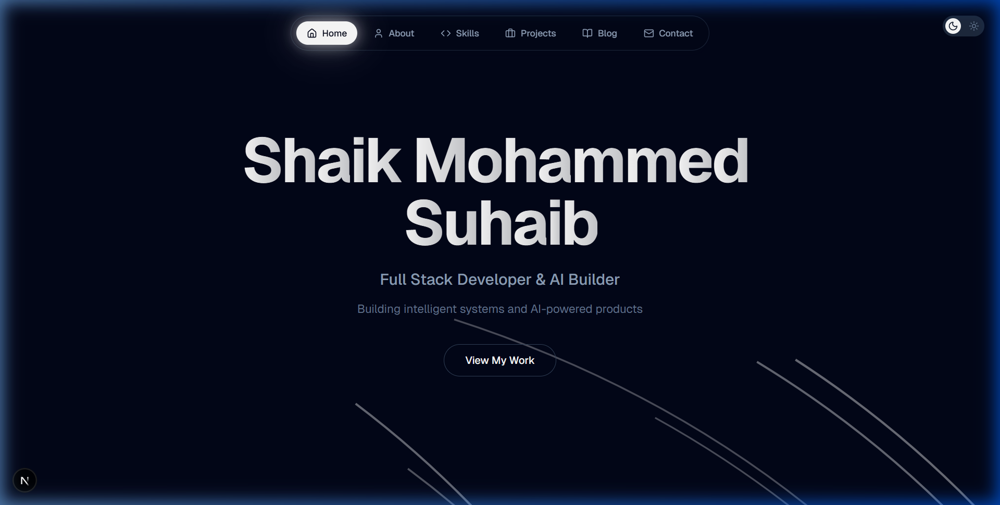

# 🚀 Shaik Mohammed Suhaib | Portfolio

A high-performance, premium developer portfolio built with the latest web technologies. This project focuses on a seamless, interactive user experience with a focus on AI systems and product engineering.

 

## ✨ Features

- **Premium Aesthetic**: Clean glassmorphism design with a deep slate color palette (`slate-950`).
- **Cutting-Edge Stack**: Powered by **Next.js 16** and **React 19**.
- **Modern Styling**: Utilizing **Tailwind CSS 4.2** for robust, performant styling.
- **Dynamic Animations**: Smooth transitions and interactive elements powered by **Framer Motion**.
- **Interactive UI**:
  - `BackgroundPaths`: Generative background visuals.
  - `LampContainer`: Cinematic lighting effects.
  - `PulseBeams`: Interactive connectivity visuals for the contact section.
  - `Inverted Cursor`: Custom desktop cursor for enhanced engagement.
  - `Skills Marquee`: Dynamic scrolling of technologies.

## 🛠️ Tech Stack

- **Framework**: [Next.js 16](https://nextjs.org/)
- **Library**: [React 19](https://react.dev/)
- **Styling**: [Tailwind CSS 4.2](https://tailwindcss.com/)
- **Animation**: [Framer Motion](https://www.framer.com/motion/) & [Motion](https://motion.dev/)
- **Components**: [Radix UI](https://www.radix-ui.com/)
- **Icons**: [Lucide React](https://lucide.dev/)

## 📬 Contact

- **Email**: [shaiksuhaib360@gmail.com](mailto:shaiksuhaib360@gmail.com)
- **LinkedIn**: [shaiksuhaib](https://www.linkedin.com/in/shaiksuhaib)
- **GitHub**: [@RIxiV1](https://github.com/RIxiV1)
- **Twitter**: [@suhaibX0](https://x.com/suhaibX0)

---

Built with ⚡ by [Shaik Mohammed Suhaib](https://github.com/RIxiV1)
