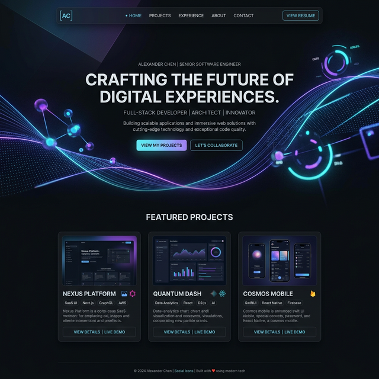

# 🚀 Premium Developer Portfolio

A high-performance, visually stunning developer portfolio built with **Astro**, **React**, and **Framer Motion**. Designed for maximum impact with a focus on premium UI/UX, 3D interactions, and seamless performance.



## ✨ Key Features

- **🌑 Premium Dark Mode**: A sleek, curated dark aesthetic designed for modern eyes.
- **✨ 3D Interactions**: Dynamic 3D background elements that react to mouse movement.
- **🎯 Custom Cursor**: A physics-based fluid cursor that enhances navigation.
- **📱 Fully Responsive**: Flawless experience across mobile, tablet, and desktop.
- **🚀 Performance First**: Optimized with Astro for lightning-fast load times.
- **🎨 Glassmorphism & Micro-animations**: Subtle, high-end visual touches throughout.

## 🛠️ Tech Stack

- **Framework**: [Astro](https://astro.build/)
- **Styling**: [Tailwind CSS](https://tailwindcss.com/)
- **Animations**: [Framer Motion](https://www.framer.com/motion/)
- **Components**: React
- **Icons**: Lucide React
- **Deploy**: GitHub Pages / Vercel / Netlify

## 📁 Project Structure

```text
/
├── public/          # Static assets (images, icons, robots.txt)
├── src/
│   ├── components/  # Reusable UI components
│   ├── data/        # Project and experience data
│   ├── layouts/     # Page layouts
│   ├── lib/         # Utility functions
│   └── pages/       # Project routes (index.astro)
└── package.json
```

## 💻 Local Setup

1. **Clone the repository**:
   ```bash
   git clone https://github.com/RIxiV1/portfolio-suhaib.git
   ```

2. **Install dependencies**:
   ```bash
   npm install
   ```

3. **Start the development server**:
   ```bash
   npm run dev
   ```

4. **Build for production**:
   ```bash
   npm run build
   ```

---

Built with ❤️ by [RIxiV1](https://github.com/RIxiV1)
