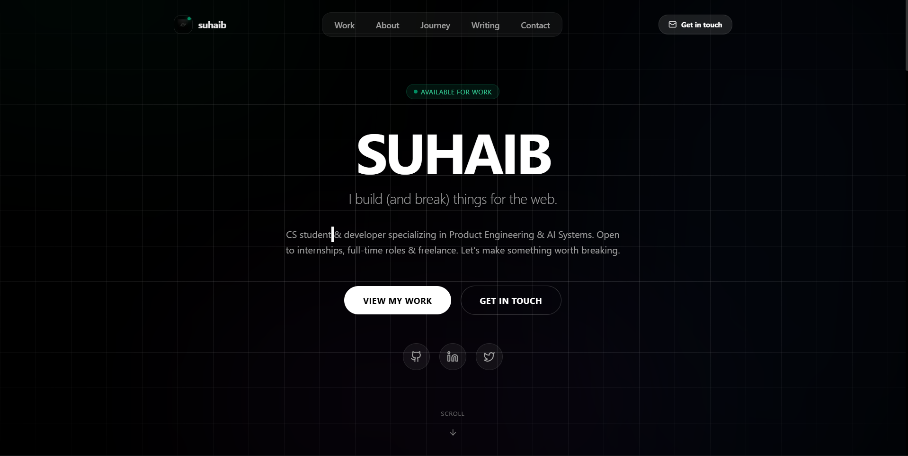

# [Shaik Suhaib](https://github.com/RIxiV1) —  Portfolio

Developer specializing in High-Performance Web Applications and AI Systems. Based in India.

[](https://github.com/RIxiV1)
[](https://www.linkedin.com/in/shaiksuhaib)
[](https://x.com/suhaibX0)
[](mailto:shaiksuhaib360@gmail.com)
[](https://portfolio-suhaib-yjpe.vercel.app/)


---

## Overview

This repository contains the source code for a premium, high-density developer portfolio built with a **Deep-Tech Aurora** aesthetic. It is engineered for maximum performance, featuring modular architecture, glassmorphism, and scroll-driven interactivity.

The project prioritizes semantic clarity and maintainability, with all personal and SEO metadata centralized in a single configuration layer.

---

## Technical Spectrum

| Layer | Technology |
| :--- | :--- |
| **Framework** | Next.js 16 (App Router) |
| **View Library** | React 19 |
| **Language** | TypeScript |
| **Styling** | Tailwind CSS 4 (Aurora Design System) |
| **Foundations** | CSS Variables + Utility-First Architecture |
| **Motion** | Framer Motion (Optimized Intersection Reveals) |
| **Icons** | Lucide React |

---

## Engineering Highlights

### Modular Architecture
The codebase follows a dashboard-inspired structure:
- **Centralized Config**: `data/site.ts` acts as the single source of truth for all content.
- **Unified Design System**: `globals.css` implements a bespoke design system with specialized `.card` and `.badge` utilities.
- **Performance Optimized**: Leverages Next.js 16 features for server-side optimization and efficient client-side transitions.

### Featured Projects
- **InfoBlend**: AI-powered Chrome extension (Manifest V3) for real-time intelligence using on-device processing.
- **SubSentry**: Financial tracking application designed to eliminate "subscription ghosting" with proactive alerting.
- **Resume Agent**: LLM-driven filtering system built with n8n for structured applicant analysis.

---

## Project Structure

A dark, minimal, fast portfolio—built to showcase work, background, and writing in one place without extra noise.

- **Readable first** — content over decoration
- **Easy to update** — most changes live in typed data files
- **Fast** — minimal UI overhead, purposeful animations

```text
.
├── app/          # Next.js App Router (Layouts & Pages)
├── components/   # Reusable UI Components (Layout, UI, Sections)
├── data/         # Site Content & Configuration (Single Source of Truth)
├── lib/          # Utility functions and shared logic (Scroll Reveals, etc.)
├── public/       # Static Assets (Images, Screenshots)
└── README.md     # Engineering Documentation
```

---

## Local Development

### Prerequisites
- Node.js 18.x or higher
- npm or yarn

### Installation
```bash
# Clone the repository
git clone https://github.com/RIxiV1/portfolio-suhaib.git
cd portfolio-suhaib

# Install dependencies
npm install

# Start development server
npm run dev
```

The application will be available at `http://localhost:3000`.

---

## Customize & Deploy

1.  **Customize**: Update `data/site.ts`, `data/projects.ts`, `data/experience.ts`, and `data/writing.ts` to reflect your information.
2.  **Deploy**: Import the repository into [Vercel](https://vercel.com/) and choose the **Next.js** preset for automatic deployment.

---

> [!NOTE]
> Designed and built by shaik suhaib.
