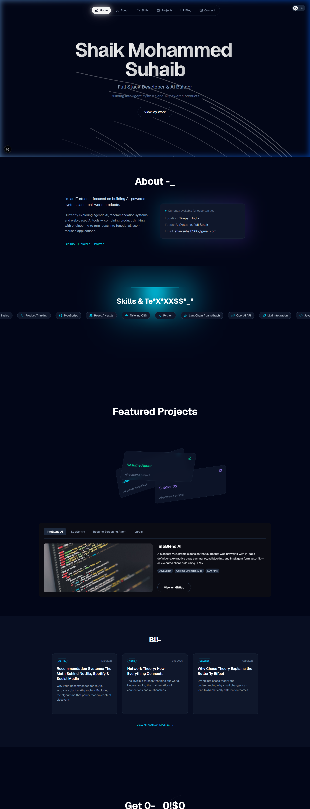

# 🚀 Shaik Mohammed Suhaib Portfolio

  

---

### ✨ Overview

A premium, interactive developer portfolio dedicated to **Agentic AI** and **Product Engineering**. Designed with a deep, cinematic aesthetic using cutting-edge technologies.

- 💎 **Glassmorphism UI**: High-end transparency and blur effects.
- ⚡ **Dynamic Motion**: Smooth transitions and scrolling via Framer Motion.
- 🤖 **AI-First Design**: Specialized sections for AI tools and intelligence.
- 🌌 **Generative Visuals**: Procedural background paths and lighting effects.

---

### 🛠️ Tech Stack

| Next.js 16 | React 19 | Tailwind 4.2 | Framer Motion | Lucide |
| :---: | :---: | :---: | :---: | :---: |
|  |  |  |  |  |

---

### 📬 Connect with Me

  
  
  
  

---

  <i>Built with passion and curiosity by Shaik Mohammed Suhaib</i>

