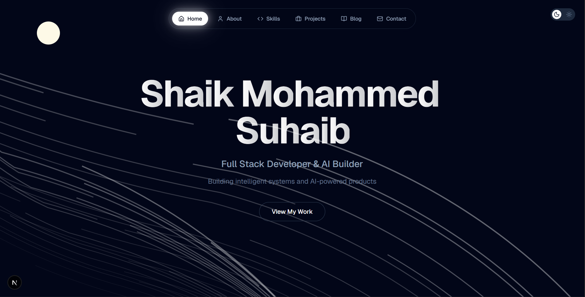

# Shaik Mohammed Suhaib — Portfolio

A personal developer portfolio focused on **Agentic AI** and **Product Engineering**, built with modern web technologies and smooth motion design.

## 🚀 Latest Updates
- **v1.2.0**: Integrated background paths and cinematic fade-up animations.
- **v1.1.0**: Added glassmorphism components and dark mode refinements.


> **Live Demo:** [your-deployed-url.vercel.app](https://your-deployed-url.vercel.app) ← _replace this_



---

## Tech Stack

| Technology | Version | Purpose |
|---|---|---|
| [Next.js](https://nextjs.org/) | 16 | Framework & routing |
| [React](https://react.dev/) | 19 | UI library |
| [TypeScript](https://www.typescriptlang.org/) | 5.7 | Type safety |
| [Tailwind CSS](https://tailwindcss.com/) | 4.2 | Styling |
| [Framer Motion](https://www.framer.com/motion/) | 11 | Animations & transitions |
| [Radix UI](https://www.radix-ui.com/) | — | Accessible UI primitives |
| [shadcn/ui](https://ui.shadcn.com/) | — | Component system |
| [Lucide React](https://lucide.dev/) | — | Icons |
| [Vercel Analytics](https://vercel.com/analytics) | — | Performance & usage insights |

---

## Features

- **Cinematic motion design** — page transitions and scroll animations via Framer Motion
- **Glassmorphism UI** — layered transparency and blur effects throughout
- **Dark-first aesthetic** — deep, high-contrast visual language
- **Fully typed** — 96%+ TypeScript coverage
- **Accessible components** — built on Radix UI primitives
- **Analytics-ready** — Vercel Analytics integrated out of the box

---

## Project Structure

```
├── app/              # Next.js App Router pages and layouts
├── components/       # Reusable UI components
├── hooks/            # Custom React hooks
├── lib/              # Utility functions and helpers
├── public/           # Static assets
└── styles/           # Global CSS and Tailwind config
```

---

## Getting Started

### Prerequisites

- [Node.js](https://nodejs.org/) v18+
- [pnpm](https://pnpm.io/) (recommended)

### Installation

```bash
# Clone the repository
git clone https://github.com/RIxiV1/portfolio-suhaib.git
cd portfolio-suhaib

# Install dependencies
pnpm install

# Start the development server
pnpm dev
```

Open [http://localhost:3000](http://localhost:3000) in your browser.

### Build for Production

```bash
pnpm build
pnpm start
```

### Deploy to Vercel

The easiest way to deploy is via the [Vercel CLI](https://vercel.com/docs/cli) or by connecting your GitHub repo to Vercel directly.

```bash
npx vercel --prod
```

---

## Contact

- **GitHub** — [@RIxiV1](https://github.com/RIxiV1)
- **LinkedIn** — [shaiksuhaib](https://linkedin.com/in/shaiksuhaib)
- **X / Twitter** — [@suhaibX0](https://x.com/suhaibX0)
- **Email** — [shaiksuhaib360@gmail.com](mailto:shaiksuhaib360@gmail.com)

---

## License

This project is open source and available under the [MIT License](./LICENSE).