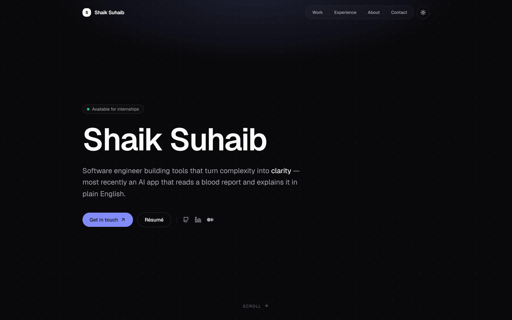

# Shaik Mohammed Suhaib — portfolio

Personal site at **[shaikuhaibdev.vercel.app](https://shaikuhaibdev.vercel.app)**.

A single-page scroll with deeper case studies for each project. Clean and premium — near-monochrome with one indigo signal, in light and dark.



---

## What's in it

- **Sections**: hero → work → experience → about → contact, each with a numbered index (`01 —— Work`). Soft fade-up page transitions between the home page and case studies.
- **Design system**: near-monochrome neutrals + a single restrained indigo accent, Geist type, medium radius, a faint dotted-grid + film-grain background, and a soft hero spotlight. Light/dark toggle with no-flash init.
- **Project cards**: image-led — real product screenshots, a results line per project, tech chips, and case-study / live / source links, with hover depth.
- **Case study pages** at `/projects/[slug]` — statically generated: problem, approach, keyed decisions with rationale, and outcome.
- **Magnetic CTAs**: the hero buttons track the cursor with spring physics.
- **Hardened contact form**: Zod-validated, Resend-delivered, Upstash-rate-limited (in-memory fallback for local dev), honeypot anti-spam, control-character stripping to defend against header injection, strict CORS validation.
- **Accessibility**: skip-to-content link, `prefers-reduced-motion` respected everywhere, focus-visible outlines, semantic HTML, JSON-LD `Person` schema, per-theme `themeColor`.

## Tech stack

- **Framework**: Next.js 16 App Router (Turbopack)
- **UI**: React 19, Tailwind CSS v4 design tokens, `motion` for animation
- **Backend**: Resend (transactional email), Upstash Redis (distributed rate limiting), Zod (request validation)
- **Hosting**: Vercel
- **Fonts**: Geist Sans + Geist Mono via `next/font/google`
- **Tooling**: ESLint (`next/core-web-vitals`) + Prettier

## Local development

```bash
npm install
npm run dev
```

Copy `.env.example` to `.env.local` and fill in `RESEND_API_KEY`, `UPSTASH_REDIS_REST_URL`, and `UPSTASH_REDIS_REST_TOKEN` if you want the contact form to deliver mail and rate-limit against a shared store. Without them the form still works locally — Resend cleanly 503s and the limiter falls back to per-worker in-memory.

## Layout

```
app/
├── api/contact/          POST endpoint: Zod + rate limit + Resend
├── projects/[slug]/      Statically generated case study pages
├── layout.tsx            Fonts, metadata + JSON-LD, dotted-grid background
├── template.tsx          Soft fade-up page transition
└── page.tsx              The one-page scroll
components/ui/
├── work-stack-link.tsx   FeaturedProject + ProjectsList (image-led cards)
├── magnetic-link.tsx     Cursor-following springs
├── reveal.tsx            Staggered entrance
├── nav.tsx, contact-form.tsx, theme-toggle.tsx, ...
data/site.ts              Single source of truth for all content
```

## Contact

- Email: [shaiksuhaib360@gmail.com](mailto:shaiksuhaib360@gmail.com)
- GitHub: [@RIxiV1](https://github.com/RIxiV1)
- LinkedIn: [in/shaiksuhaib](https://www.linkedin.com/in/shaiksuhaib)
- Medium: [@shaiksuhaib360](https://medium.com/@shaiksuhaib360)

---

MIT © Shaik Mohammed Suhaib
